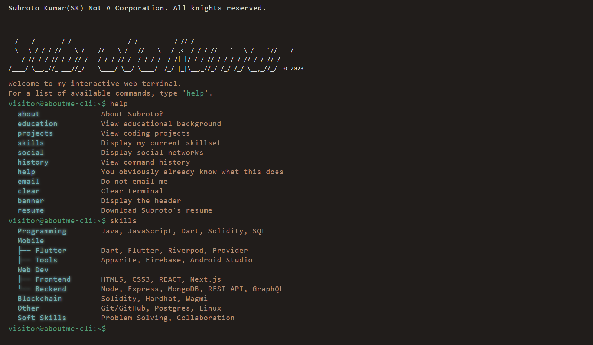

# ABOUTME-CLI

The About Me CLI is an interactive web terminal built with React. It allows visitors to learn more about person by entering various commands such as about, skills, resume, and social.

## Table of Contents
Installation  
Usage  
Contributing  
License  

## **Installation**  

To run the About Me CLI locally, follow these steps:

1. Clone this repository to your local machine.
2. Navigate to the project directory.
3. Run `npm install` or `yarn` to install all dependencies.
4. Run `npm dev` or `yarn dev` to start the development server.
5. Open http://localhost:5173 in your web browser to view the app.  

## **Usage**
The About Me CLI is a simple and fun way for visitors to learn more about Subroto Kumar, the developer behind the app. The CLI interface allows visitors to type in various commands to access different pieces of information. 

The following commands are available:

- `about`: Show information about my background and experience.
- `banner`: Displays the banner at the top of the app.
- `clear`: Dlears the terminal screen.
- `education`: Show information about my education history.
- `email`: Show my email address.
- `help`: Displays a list of available commands.
- `history`: Displays a list of previously entered commands.
- `resume`: Displays my resume.
- `skills, skill`: Displays information about my skills.
- `social`: Displays my social media handles.

## **Contributing**
Contributions are welcome and appreciated. If you encounter any issues or have suggestions for improvements, please create a GitHub issue or submit a pull request.

## **License**
The About Me CLI is open source software licensed under the `MIT` License. Feel free to use the code for personal or commercial use.